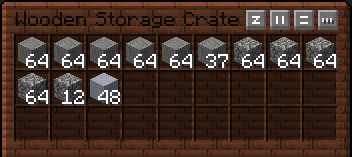
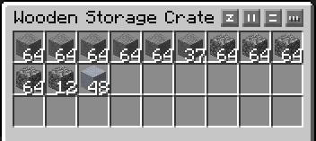

# Resource Packs

## Vanilla Crate

Download on:

- [Modrinth](https://modrinth.com/resourcepack/vanilla-crate)
- [Curseforge](https://www.curseforge.com/minecraft/texture-packs/vanilla-crate)

Retextures the Immersive Engineering crate to match the vanilla chest texture.

Before:

After:

